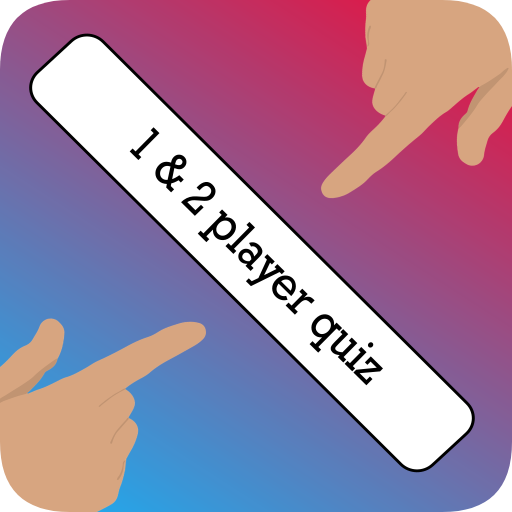

# Two player quiz

The ultimate test of wits and knowledge where you can challenge your friends and compete in an exciting duel format! Whether you're looking to outsmart your friends or hone your skills solo, Duel Quiz offers an immersive experience with its diverse range of questions spanning various fields.

  

    
  

  

    
  

<em>Please note that the code for this application is private.</em>

## Features

### Solo Mode
Put your knowledge to the test in solo mode. Submit your scores and climb the leaderboard as you strive for mastery. In solo mode, your score determines your standing on the leaderboard. Test your skills and aim for the top spot!

### Split-Screen Mode
Experience the excitement of the duel quiz in split-screen mode. Share the fun with friends and family for an unforgettable gaming experience.

## Scoring Options

Duel Quiz offers two scoring options for two-player matches:

- **True/False**: Earn points based on accuracy and speed. React quickly and answer correctly to claim victory.
- **Points**: Calculate scores based on accuracy and the time remaining. Every second counts in this thrilling challenge.

## Languages Supported

Duel Quiz supports two languages: Serbian and English, ensuring accessibility and inclusivity for all players.

## Exciting Features

- **Engaging Gameplay**: Experience the thrill of one of the best 2-player reaction games, where knowledge and speed are paramount.
- **Family-Friendly Fun**: Enjoy trivia games with friends and family, stimulating thinking speed and expanding knowledge.
- **Offline Accessibility**: Duel Quiz is free and works offline, making it the perfect companion for players of all ages, anytime, anywhere.
